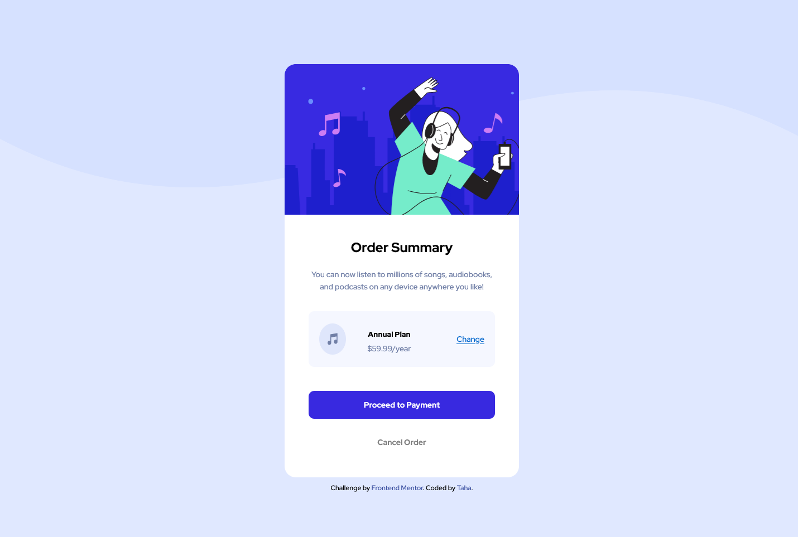

# Frontend Mentor - Order Summary Component

This is a solution to the [Order Summary Component](https://www.frontendmentor.io/challenges/order-summary-component-QlPmajDUj).

## Table of contents

- [Overview](#overview)
- [The challenge](#the-challenge)
- [Screenshots](#screenshots)
- [Links](#links)
- [Built with](#built-with)
- [Author](#author)

## Overview

### The challenge

Users should be able to:

- View the optimal layout depending on their device's screen size
- See hover states for interactive elements

### Screenshots

#### Desktop View

#### Mobile View

### Links

- Solution URL: [Frontend Mentor](https://www.frontendmentor.io/profile/thaykrgl)
- Live Site URL: [Github Pages](https://thaykrgl.github.io/order-summary-component/)

## My process

### Built with

- Semantic HTML5 markup
- Mobile-first workflow
- Flexbox
- Media Queries
- Google Fonts

## Author

- Linkedin - [Taha](https://www.linkedin.com/in/tahaaykiroglu)
- Frontend Mentor - [@thaykrgl](https://www.frontendmentor.io/profile/thaykrgl)
